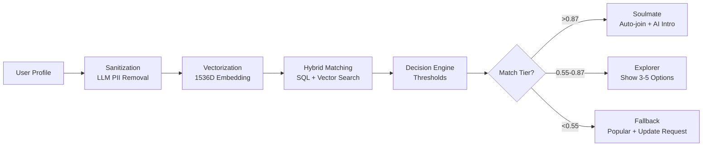

# AI-Powered Community Matching System v2.0

Intelligent onboarding solution with **<2 second** community matching using hybrid algorithms.

---

## 🏗️ Architecture

### Tech Stack
- **API**: Python FastAPI (async, Pydantic validation)
- **Authentication**: Clerk (offline JWT verification & Clerk Webhooks synchronization)
- **Task Queue**: Celery + Redis broker (using `-P solo` pool for Windows environment stability)
- **Database**: PostgreSQL 16 (14 comprehensive schema tables for users, communities, events, connections, and audit logs) + Pinecone (vectors)
- **AI/ML**: OpenAI GPT-4o-mini + text-embedding-3-small
- **Real-time**: WebSocket + Redis Pub/Sub
- **Admin System**: Dedicated admin router for managing user bans, flags, and logging admin audit trails.

### Matching Pipeline (5 Phases)



---

## 🚀 Quick Start

### 1. Installation

```bash
# Clone repository
git clone <repo_url>
cd VAYO

# Create & activate local python virtual environment
python -m venv .venv
.venv\Scripts\activate

# Install dependencies
pip install -r requirements.txt
```

### 2. Configure Environment

```bash
# Copy env template
cp .env.example .env

# Edit .env with your actual local configuration (e.g. Postgres passwords, Clerk Secrets)
```

### 3. Database Setup & Seeding

```bash
# Run the base migrations to create all tables (Users, Connections, Communities, Events, Bans, Audits)
psql -U postgres -d community_matching -f users_table.sql

# Apply database schema fixes and new table additions
psql -U postgres -d community_matching -f schema_fix_migration.sql

# Apply Karma Points System migrations
psql -U postgres -d community_matching -f karma_migration.sql

# Apply WhatsApp join flow migrations
psql -U postgres -d community_matching -f whatsapp_migration.sql

# Apply Events Share & Scheduler migrations
psql -U postgres -d community_matching -f events_share_migration.sql

# Seed the database with 5 premium communities (AI, Design, PM, FinTech, Business)
psql -U postgres -d community_matching -f add_communities.sql
```

### 4. Start Services

```bash
# Terminal 1: Start FastAPI Dev Server
uvicorn api:app --reload --port 8000

# Terminal 2: Start Celery Worker (with solo pool for Windows stability)
celery -A celery_tasks worker --loglevel=info -P solo

# Terminal 3: Start Redis Server (WSL2 or Native Service)
redis-server
```

---

## 🧠 Hybrid Matching Algorithm

### Phase A: Location Filter (SQL)
```python
# Reduces search space by ~95%
WHERE city = $1 AND timezone = $2 AND is_active = true
```

### Phase B: Vector Search (Pinecone)
```python
# Cosine similarity on filtered subset
query(vector=user_embedding, top_k=20, filter={"community_id": {"$in": filtered_ids}})
```

### Phase C: Diversity Injection
```python
# If top 3 matches are same category, inject 1 diverse match at position 2
if all_same_category(top_3):
    inject_diverse_match()
```

---

## 📊 Decision Engine Thresholds

| Tier | Threshold | Action |
|------|-----------|--------|
| **Soulmate** | >0.87 | Auto-join community + AI-generated intro with @mention |
| **Explorer** | 0.55-0.87 | Show 3-5 match options with scores |
| **Fallback** | <0.55 | Show popular communities + request profile update |

---

## 🎯 AI Introduction Generator

Triggered on **Soulmate** matches:

1. Fetch user bio + community description
2. Retrieve top 5 active members (7-day activity)
3. Generate friendly intro (max 3 sentences) with GPT-4o-mini
4. Run toxicity check (block if score >0.75)
5. Post to community channel with @mention

---

## 💾 Caching Strategy

| Layer | Data | TTL | Storage |
|-------|------|-----|---------|
| L1 (Browser) | Static assets | 24h | LocalStorage |
| L3 (Redis) | User vectors | 7 days | Redis pickle |
| L3 (Redis) | Group vectors | 24h | Redis pickle |
| L4 (PostgreSQL) | Query results | 15min | Redis JSON |

---

## 📝 Code Structure

```
.
├── admin_router/
│   ├── admin_router.py  # Admin controls (bans, flags, audits)
│   └── admin_events_extension.py # Admin events extension controls
├── docs/                # Detailed guides and manuals (docs/README.md)
├── scratch/             # Refactoring & experiment scripts
├── tests/               # Unit & Integration tests for Clerk & API
├── api.py               # FastAPI application entrypoint & Webhook handler
├── auth.py              # Clerk JWT & Svix Webhook signature verification
├── celery_tasks.py      # Celery asynchronous matching task pipeline
├── models.py            # Pydantic data schemas
├── event_models.py      # Event management schemas & models
├── database.py          # Postgres & Pinecone database manager
├── ai_services.py       # LLM processing & profile enrichment
├── cache.py             # Redis caching & messaging
├── whatsapp_router.py   # WhatsApp moderated join flow endpoints
├── notifications_router.py # Notification routes & utility triggers
├── events_router.py     # Event creation, sharing, & RSVP endpoints
├── event_scheduler.py   # Background job runner for event reminders/penalties
├── scheduler.py         # Scheduler base logic using APScheduler
├── users_table.sql      # Database Schema (Base tables)
├── schema_fix_migration.sql # Schema correction migration
├── karma_migration.sql  # Karma Points & user score ledger migrations
├── whatsapp_migration.sql # WhatsApp schema migration
├── events_share_migration.sql # Event sharing & Scheduler migration
├── add_communities.sql  # Database Seed script (5 Premium communities)
├── requirements.txt     # Python package requirements
├── .env.example         # Configuration template
└── README.md            # Documentation
```

---

## 🐛 Troubleshooting

### Windows Celery prefork crash
- Run Celery using the solo execution pool: `celery -A celery_tasks worker -loglevel=info -P solo`.

### WSL2 DNS Resolution issues
- Configure `/etc/wsl.conf` with `generateResolvConf = false`, remove symlink, and hardcode Google DNS `nameserver 8.8.8.8` inside `/etc/resolv.conf`.

### Low match scores
- Review embedding quality and check if location filtering is too restrictive.

## 📄 License

MIT License
